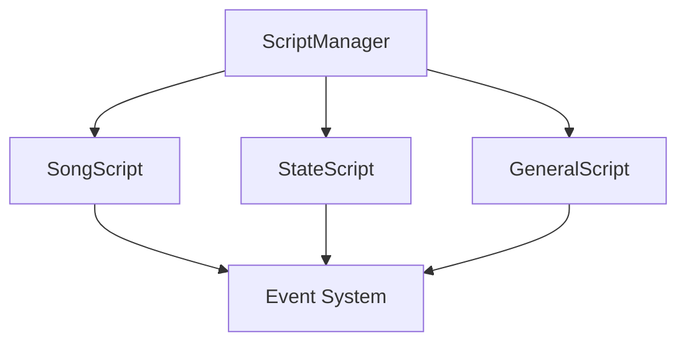
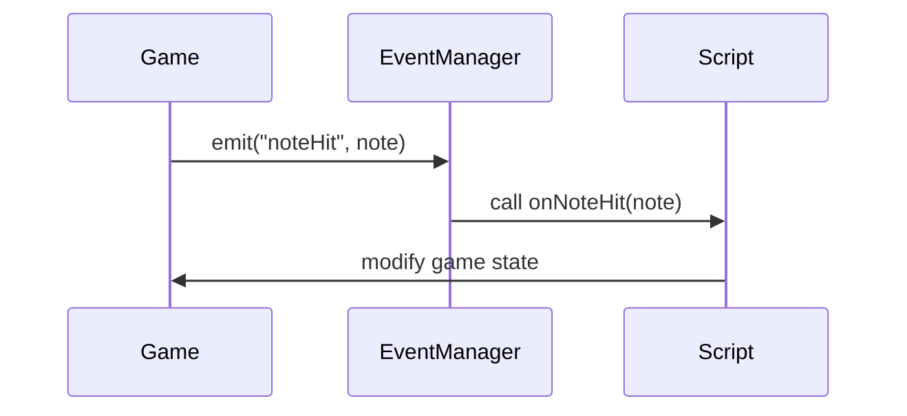

```markdown
# BeatStreets Scripting Documentation

## Table of Contents
1. [Overview](#overview)
2. [Script Types](#script-types)
3. [Directory Structure](#directory-structure)
4. [Events System](#events-system)
5. [Script API Reference](#script-api-reference)
6. [Examples](#examples)

## Overview

The BeatStreets scripting system allows you to create custom behaviors using HScript. Scripts can control gameplay, add effects, modify states and create custom events.



## Directory Structure

```
assets/
├── data/
    ├── scripts/
    │   ├── class/      # Class-specific scripts
    │   ├── general/    # General utility scripts  
    │   └── plugins/    # Script plugins
    ├── songs/
    │   └── songname/   # Song-specific scripts
    └── characters/     # Character scripts
```

## Script Types

### Song Scripts
Located in `assets/data/songs/[songname]/script.hx`
```haxe
// Song script example
function onBeatHit(beat:Int) {
    if (beat % 4 == 0) {
        game.defaultCamZoom += 0.1;
    }
}

function onNoteHit(note:Note) {
    if (note.isSustainNote) {
        // Do something on sustain notes
    }
}
```

### Class Scripts 
Located in `assets/data/scripts/class/[ClassName].hx`
```haxe
// Class script example
function onCreate() {
    // Initialize state
}

function onUpdate(elapsed:Float) {
    // Update logic
}

function onDestroy() {
    // Cleanup
}
```

### General Scripts
Located in `assets/data/scripts/general/[name].hx`
```haxe
// Utility functions
function createEffect(target:FlxSprite) {
    // Create visual effect
}
```

## Events System

The event system allows scripts to communicate and react to game events:



### Core Events

| Event | Description | Parameters |
|-------|-------------|------------|
| onCreate | Called when script is created | None |
| onDestroy | Called when script is destroyed | None |
| onUpdate | Called every frame | elapsed:Float |
| onBeat | Called on beat hit | beat:Int |
| onStep | Called on step hit | step:Int |
| onNoteHit | Called when note is hit | note:Note |
| onNoteMiss | Called when note is missed | direction:Int, isSustain:Bool |
| onSectionHit | Called when section changes | section:Int |
| onCustomEvent | Called for custom events | name:String, params:Dynamic |

## Script API Reference

### Game State Access
```haxe
// Access game state
game            // Current PlayState instance
state           // Current state instance
song            // Song data

// Cameras
game.camGame    // Main game camera
game.camHUD     // HUD camera 
game.camEffect  // Effects camera
```

### Utility Functions
```haxe
// Tweens
tween(object, {x: 100}, 1.0, "linear")

// Timers 
setTimeout(callback, 1000)

// Sprites
makeSprite(x, y, "image")
playAnim(sprite, "anim", forced)

// Sound
playSound("sound", volume)

// Math
lerp(start, end, ratio)
random(min, max)
```

### Events
```haxe
// Listen for events
on("noteHit", function(note) {
    // Handle note hit
})

// Emit custom events
emit("myEvent", {data: value})
```

## Examples

### Basic Song Script
```haxe
// assets/data/songs/test/script.hx

var zoom:Float = 1.0;

function onCreate() {
    // Initialize
    game.defaultCamZoom = zoom;
}

function onBeat(beat:Int) {
    if (beat % 4 == 0) {
        // Camera zoom effect
        game.defaultCamZoom = zoom + 0.1;
        tween(game, {defaultCamZoom: zoom}, 0.2);
        
        // Emit custom event
        emit("zoomEffect", {amount: 0.1});
    }
}

function onNoteHit(note:Note) {
    // Effects on note hit
    if (note.isSustainNote) return;
    
    playSound("hitSound", 0.5);
    createEffect(note);
}
```

### Custom Plugin
```haxe
// assets/data/scripts/plugins/EffectPlugin.hx

class EffectPlugin implements Plugin {
    private var manager:ScriptManager;
    
    public function init(manager:ScriptManager) {
        this.manager = manager;
        
        // Add custom functions
        manager.set("createEffect", createEffect);
    }
    
    public function createEffect(target:FlxSprite) {
        // Effect implementation
    }
    
    public function update(elapsed:Float) {
        // Update effects
    }
    
    public function destroy() {
        // Cleanup
    }
}
```

### General Utility Script
```haxe
// assets/data/scripts/general/Utils.hx

function flashSprite(sprite:FlxSprite, color:Int, duration:Float) {
    sprite.color = color;
    tween(sprite, {color: 0xFFFFFF}, duration);
}

function shakeCamera(intensity:Float, duration:Float) {
    game.camGame.shake(intensity, duration);
}

function createTrail(target:FlxSprite, length:Int = 10) {
    // Create trail effect
}
```

## Tips & Best Practices

1. Use descriptive event names
2. Clean up resources in onDestroy
3. Keep scripts modular and reusable
4. Use plugins for complex functionality
5. Document script parameters and events
6. Test scripts in isolation
7. Use version control for scripts
8. Profile script performance

## Debug Mode

Enable debug mode to see script logs:
```haxe
ScriptManager.DEBUG = true;
```

Debug output will show:
- Script loading/errors
- Event emissions
- Function calls
- Performance metrics

## Support

For more examples and support:
- Check the examples folder
- Read the API documentation  
- Join the Discord community
- Report issues on GitHub

## Extra Tips

1. Hot reloading scripts:
```haxe
if (FlxG.keys.justPressed.R) {
    reloadCurrentScript();
}
```

2. Script error handling:
```haxe
try {
    script.callFunction("onUpdate", [elapsed]);
} catch(e) {
    trace('Script error: ${e.message}');
}
```

3. Performance monitoring:
```haxe 
var startTime = Date.now().getTime();
script.callFunction("update");
var endTime = Date.now().getTime();
trace('Script took ${endTime - startTime}ms');
```