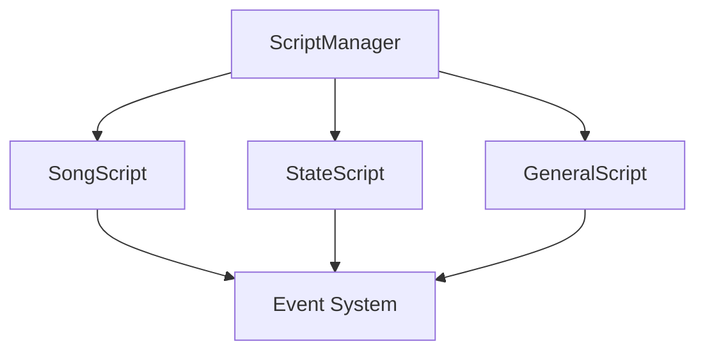
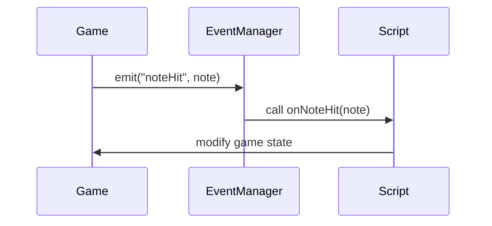

# Madness Makeover Scripting Documentation

## Table of Contents
1. [Overview](#overview)
2. [Script Types](#script-types)
3. [Directory Structure](#directory-structure)
4. [Events System](#events-system)
5. [Script API Reference](#script-api-reference)
6. [Examples](#examples)

## Overview
Madness Makeover uses HScript for modding and custom gameplay logic. Scripts can be used to modify gameplay, create custom events, and add new features.



## Directory Structure

```
assets/
├── data/
    ├── scripts/
    │   ├── class/      # Class-specific scripts
    │   ├── general/    # General utility scripts  
    ├── songs/
    │   └── songname/   # Song-specific scripts
    └── characters/     # Character scripts
```

## Script Types

### State Scripts
State scripts are loaded automatically for each game state. They can modify state behavior and add new features.

```haxe
// Example state script
function onCreate() {
    trace("State created!");
}

function onBeatHit(beat:Int) {
    trace("Beat: " + beat);
}
```

### Song Scripts
Song scripts handle song-specific logic and events. They are loaded with each song.

```haxe
// Example song script
function zoom() {
    game.camGame.zoom += 0.015;
    game.camHUD.zoom += 0.03;
}
```

### Class Scripts 
Located in `assets/(preload)/scripts/class/[ClassName].hx`
```haxe
// Class script example
function onCreate() {
    // Initialize state
}

function onUpdate(elapsed:Float) {
    // Update logic
}

function onDestroy() {
    // Cleanup
}
```

### General Scripts
Located in `assets/(preload)/scripts/general/[name].hx`
```haxe
// Utility functions
function createEffect(target:FlxSprite) {
    // Create visual effect
}
```

## Events System

The event system allows scripts to communicate and react to game events:



### Core Events

| Event | Description | Parameters |
|-------|-------------|------------|
| onCreate | Called when script is created | None |
| onDestroy | Called when script is destroyed | None |
| onUpdate | Called every frame | elapsed:Float |
| onBeatHit | Called on beat hit | beat:Int |
| onStepHit | Called on step hit | step:Int |
| onNoteHit | Called when note is hit | note:Note |
| onNoteMiss | Called when note is missed | direction:Int, isSustain:Bool |
| onSectionHit | Called when section changes | section:Int |
| onCustomEvent | Called for custom events | name:String, params:Dynamic |

## Script API Reference

### Game State Access
```haxe
// Access game state
Game            // Current PlayState instance
state           // Current state instance
song            // Song data

// Cameras
Game.camGame    // Main game camera
Game.camHUD     // HUD camera 
Game.camEffect  // Effects camera
```

### Utility Functions
```haxe
// Tweens
tween(object, {x: 100}, 1.0, "linear")

// Timers 
setTimeout(callback, 1000)

// Sprites
makeSprite(x, y, "image")
playAnim(sprite, "anim", forced)

// Sound
playSound("sound", volume)

// Math
lerp(start, end, ratio)
random(min, max)
```

### Available Functions

#### Base Functions
- `trace(message)` - Print debug messages
- `setTimeout(callback, ms)` - Run code after delay
- `setTimer(delay, callback)` - Create repeating timer
- `random(min, max)` - Get random number
- `getCurrentDateTime()` - Get current date/time

#### Sprite Functions
- `makeSprite(x, y, ?graphic)` - Create sprite
- `makeAnimatedSprite(x, y, graphic, width, height)` - Create animated sprite
- `addAnimation(sprite, name, frames, fps, loop)` - Add sprite animation
- `playAnim(sprite, name, forced)` - Play sprite animation

#### Camera Functions
- `setCameraFollow(target, style)` - Make camera follow target
- `shakeCamera(intensity, duration)` - Shake camera
- `flashSprite(sprite, color, duration)` - Flash sprite

#### Visual Effects
- `createEffect(target, type, duration)` - Add visual effect
- `createTrail(target, length, delay, alpha)` - Create trail effect

#### Sound Functions  
- `loadSound(path)` - Load sound file
- `playSound(sound, volume)` - Play sound

#### Math Helpers
- `lerp(start, end, ratio)` - Linear interpolation
- `clamp(value, min, max)` - Clamp value
- `degToRad(degrees)` - Convert degrees to radians
- `radToDeg(radians)` - Convert radians to degrees
- `angleBetween(x1, y1, x2, y2)` - Get angle between points
- `distanceBetween(x1, y1, x2, y2)` - Get distance between points

#### State Management
- `switchState(state)` - Switch game state
- `resetState()` - Reset current state
- `openSubState(scriptPath)` - Open substate
- `closeSubState()` - Close substate
- `switchToScriptState(scriptPath)` - Switch to script state

### Events
```haxe
// Listen for events
on("noteHit", function(note) {
    // Handle note hit
})

// Emit custom events
emit("myEvent", {data: value})
```

Scripts can listen for events using `on()` and `once()`:

```haxe
// Listen for event
on("onBeatHit", function(beat) {
    trace("Beat hit: " + beat);
});

// Listen once
once("onCreate", function() {
    trace("Created!");
});
```

#### Available Events
- `onCreate` - When state/script is created
- `onDestroy` - When state/script is destroyed  
- `onUpdate` - Every frame
- `onBeatHit` - On beat
- `onStepHit` - On step
- `onCountdown` - During countdown
- `onStartSong` - When song starts
- `onEndSong` - When song ends
- `onNoteMiss` - When note is missed
- `onGoodNoteHit` - When note is hit
- `onOppNoteHit` - When opponent hits note

## Examples

### Basic Song Script
```haxe
// assets/data/songs/test/script.hx

var zoom:Float = 1.0;

function onCreate() {
    // Initialize
    Game.defaultCamZoom = zoom;
}

function onBeatHit(beat:Int) {
    if (beat % 4 == 0) {
        // Camera zoom effect
        Game.defaultCamZoom = zoom + 0.1;
        tween(Game, {defaultCamZoom: zoom}, 0.2);
        
        // Emit custom event
        emit("zoomEffect", {amount: 0.1});
    }
}

function onNoteHit(note:Note) {
    // Effects on note hit
    if (note.isSustainNote) return;
    
    playSound("hitSound", 0.5);
    createEffect(note);
}
```

### Custom Event
```haxe
function onBeatHit(beat:Int) {
    if (beat % 4 == 0) {
        Game.camGame.zoom += 0.015;
        Game.camHUD.zoom += 0.03;
    }
}
```

### Camera Effects
```haxe
function createCameraEffect() {
    Game.camGame.shake(0.01, 0.2);
    flashSprite(Game.camGame, 0xFFFFFFFF, 0.15);
}
```

### Character Animation
```haxe
function customDance() {
    Game.bf.playAnim('hey');
    Game.gf.playAnim('cheer');
} 
```

### General Utility Script
```haxe
// assets/data/scripts/general/Utils.hx

function flashSprite(sprite:FlxSprite, color:Int, duration:Float) {
    sprite.color = color;
    tween(sprite, {color: 0xFFFFFF}, duration);
}

function shakeCamera(intensity:Float, duration:Float) {
    Game.camGame.shake(intensity, duration);
}

function createTrail(target:FlxSprite, length:Int = 10) {
    // Create trail effect
}
```

## Tips & Best Practices

1. Use descriptive event names
2. Clean up resources in onDestroy
3. Keep scripts modular and reusable
4. Use plugins for complex functionality
5. Document script parameters and events
6. Test scripts in isolation
7. Use version control for scripts
8. Profile script performance

### Best Practices

1. Always check if objects exist before using them
2. Use try/catch for error handling
3. Clean up resources in onDestroy
4. Keep performance in mind with effects
5. Use consistent naming conventions
6. Comment complex logic
7. Break up large functions
8. Cache frequently accessed values

## Debug Mode

Enable debug mode to see script logs:
```haxe
ScriptManager.DEBUG = true;
```

Debug output will show:
- Script loading/errors
- Event emissions
- Function calls
- Performance metrics

## Debugging

Set `ScriptManager.DEBUG = true` to enable debug logging:

```haxe
ScriptManager.DEBUG = true;
```

This will show:
- Script loading/errors
- Function calls
- Variable access
- Event dispatching

## Support

For more examples and support:
- Check the examples folder
- Read the API documentation  
- Join the Discord community
- Report issues on GitHub

## Extra Tips

1. Hot reloading scripts:
```haxe
if (FlxG.keys.justPressed.R) {
    reloadCurrentScript();
}
```

2. Script error handling:
```haxe
try {
    script.callFunction("onUpdate", [elapsed]);
} catch(e) {
    trace('Script error: ${e.message}');
}
```

3. Performance monitoring:
```haxe 
var startTime = Date.now().getTime();
script.callFunction("update");
var endTime = Date.now().getTime();
trace('Script took ${endTime - startTime}ms');
```